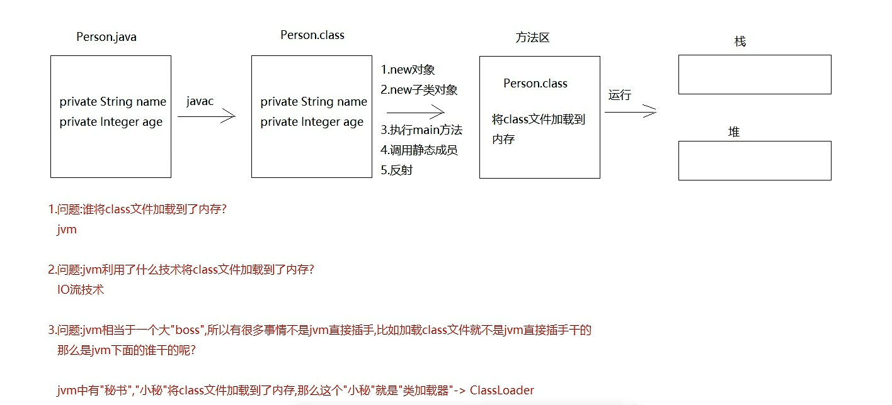
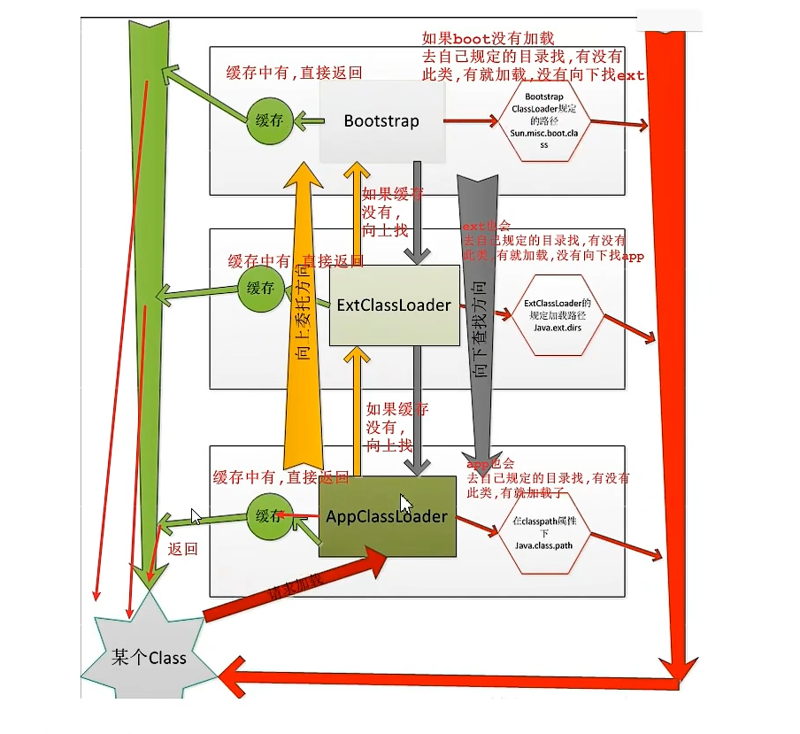
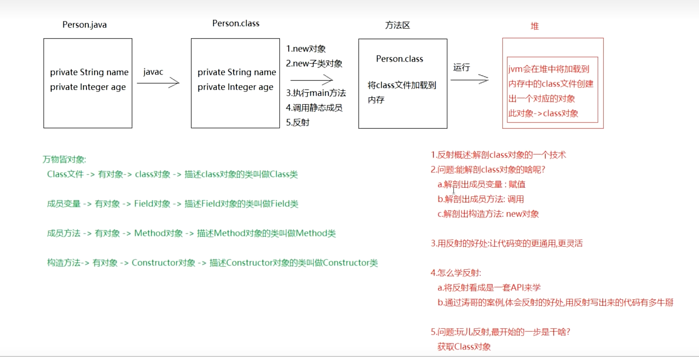

    二十五章反射_注解:类的加载实际_反射_注解_元注解_枚举
# 第二章. 类的加载时机

以下是Java中触发类加载的常见场景：

1.  `new`对象（创建类的实例）
2.  `new`子类对象（创建子类实例时，会先初始化父类）
3.  执行类的`main`方法
4.  调用类的静态成员（静态变量或静态方法）
5.  通过反射创建`Class`对象

## 1. 类加载器（基于 JDK 8）_ClassLoader

### 1. 概述
在 JVM 中，负责将本地的 `.class` 文件加载到内存的对象，就是 `ClassLoader`（类加载器）。

### 2. 分类
- **`BootstrapClassLoader`（根类加载器）**
    - 由 C 语言编写，Java 代码中无法直接获取。
    - 也叫引导类加载器，负责加载 Java 核心类（如 `System`、`String` 等，位于 `jre/lib/rt.jar` 下）。

- **`ExtClassLoader`（扩展类加载器）**
    - 负责加载 JRE 扩展目录（`jre/lib/ext`）中的 jar 包。

- **`AppClassLoader`（系统类加载器）**
    - 负责加载自定义类（通过 `java` 命令运行的类），以及 `classpath` 环境变量指定的第三方 jar 包。

### 3. 三者的关系
- **从类加载机制层面（双亲委派模型）**：
    - `AppClassLoader` 的父加载器是 `ExtClassLoader`
    - `ExtClassLoader` 的父加载器是 `BootstrapClassLoader`
- **从代码继承关系看**：它们之间没有父子继承关系，都继承自同一个父类 `ClassLoader`。

### 4. 获取类加载器对象
通过 `Class` 对象的 `getClassLoader()` 方法获取： 类名.class.getClassLoader();

### 5. 获取类加载器对象对应的父类加载器
通过 ClassLoader 类的 getParent() 方法获取（实际使用场景较少）。

### 6. 双亲委派机制（全盘负责委托机制）
1.  **示例**：`Person` 类中有一个 `String` 成员
    - `Person` 类由 `AppClassLoader` 加载
    - `String` 类由 `BootstrapClassLoader` 加载

2.  **加载流程**：
    - `AppClassLoader` 在加载 `String` 时，会先委托给父加载器 `ExtClassLoader`。
    - `ExtClassLoader` 无法加载核心类，继续委托给它的父加载器 `BootstrapClassLoader`。
    - `BootstrapClassLoader` 识别出 `String` 是核心类，由它完成加载。

---

### 7. 类加载器的缓存（Cache）机制
- 类被加载到内存后，会在缓存中保存一份。
- 后续使用该类时，会直接从缓存中获取，不会重新加载。
- 作用：**保证了类在内存中的唯一性**。

---

### 8. 总结
双亲委派机制与缓存机制共同作用，保证了类在内存中的唯一性。

---


# 第三章. 反射

## 1. Class类与反射介绍
1.  **反射概述**：一种“解剖`Class`对象”的技术。
2.  **反射能解剖的内容**：
    - 成员变量：用于赋值
    - 成员方法：用于调用
    - 构造方法：用于创建对象
3.  **反射的好处**：让代码更通用、更灵活。
4.  **学习思路**：
    - 将反射看作一套API来学习
    - 通过案例体会反射的优势
5.  **反射的第一步**：获取`Class`对象。
6.  **概念区分**：
    - `Class`对象：`.class`文件在内存中对应的对象。
    - `Class`类：描述`Class`对象的类，即`java.lang.Class`。


## 2. 反射之获取Class对象

### 获取`Class`对象的三种方式
1.  **方式1：调用`Object`类的`getClass()`方法**:
    Class<?> clazz = 对象.getClass();
2. **方式2：使用类的静态成员class
   基本类型和引用类型都支持，格式为**：Class<?> class = 类名.class;
3. **方式 3：调用Class类的静态方法forName()**:Class<?> clazz = Class.forName("类的全限定名");
  其中，参数是类的全限定名（即包名.类名）。

### 2.1 三种获取`Class`对象的方式中最`通用`的一种

1.  **核心方式**：方式 3：调用Class类的静态方法forName()**:Class<?> clazz = Class.forName("类的全限定名");
    其中，参数是类的全限定名（即包名.类名）。
2. 原因:String为参数时,可以结合Properties文件使用

### 2.2 三种获取`Class`对象的方式中最`常用`的一种
直接类名.class

## 3. 获取Class对象中的构造方法

### 3.1 获取所有public的构造方法
1.  Class类中的方法：
    ```
    Constructor<?>[] getConstructors()//获取类中所有public修饰的构造方法
    
    ```

### 3.2 获取空参构造（public）

1. **Class类方法：获取指定public构造方法**
```
    Constructor<T> getConstructor(Class<?>... parameterTypes);
```
- parameterTypes：可变参数，可传 0 个或多个 
  - 获取空参构造：不写参数
  - 获取有参构造：传入参数类型的 Class 对象
2. **Constructor 类方法：创建对象**
```
    T newInstance(Object... initargs);
```
- initargs：构造方法的实参
    - 无参构造：不写参数
    - 有参构造：传入对应实参
- 示例
```
public class Demo04GetConstructor {
    public static void main(String[] args) throws Exception {
        // 1. 获取Class对象
        Class<Person> aClass = Person.class;

        // 2. 获取public空参构造方法
        Constructor<Person> constructor = aClass.getConstructor();
        System.out.println("constructor = " + constructor);

        // 3. 使用空参构造创建对象（等价于 new Person()）
        Person person = constructor.newInstance();

        // 4. 输出对象
        System.out.println(person);
    }
}   
```

### 3.3 获取私有构造(暴力反射)
1. **Class类方法：获取所有构造方法(包括私有)**
```
    Constructor<?>[] getDeclaredConstructors();//获取类中所有构造方法(包括私有)
    Constructor<T> getDeclaredConstructor(Class<?>... parameterTypes);//获取类中指定构造方法(私有也可以指定)
```
- parameterTypes：可变参数，可传 0 个或多个
    - 获取空参构造：不写参数
    - 获取有参构造：传入参数类型的 Class 对象
2. **暴力反射**:Constructor有一个父类叫做AccessibleObject,里面有个方法
- void setAccessible(boolean flag)->修改访问权限(修改后才能使用该构造)
  - flag为true，解除私有权限

## 4. 反射方法

### 4.1 利用反射获取所有public成员方法
- `Class`类方法：
  ````
  Method[] getMethods();//作用：获取当前类及所有父类中所有public修饰的成员方法。
  //示例代码
  private static void method01() {
    Class<Person> aClass = Person.class;
    Method[] methods = aClass.getMethods();
    for (Method method : methods) {
        System.out.println(method);
    }
  } 
  ````

### 4.2 反射获取指定 public 成员方法（有参 / 无参）
- `Class`类方法：
 ````
    Method getMethod(String name, Class<?>... parameterTypes);
    //name：要获取的方法名
    //parameterTypes：方法参数类型的 Class 对象（无参方法可省略）

````
- **方法调用:** 成员方法对象.invoke(操作对象,方法参数),如果方法有返回值，则可以直接接收invoke的返回值,没有则null

### 4.3 反射之操作私有成员方法
1. **Class类方法：获取所有构造方法(包括私有)**
```
    Constructor<?>[] getDeclaredMethods();//获取类中所有成员方法(包括私有)
    Constructor<T> getDeclaredMethod(String name,Class<?>... parameterTypes);//获取类中指定成员方法(私有也可以指定)
```
- parameterTypes：可变参数，可传 0 个或多个
    - name：传递方法名
    - 获取有参方法：传入方法参数的 class 对象
2. **操作方法:** void setAccessible(boolean flag)->修改访问权限
    - flag为true，解除私有权限
3. **调用方法:**  invoke(类对象,方法参数);

## 5. 反射成员变量
### 5.1 获取所有属性（Java反射）

- **Class类方法：**
    1.  `Field[] getFields()`：获取类中所有 `public` 修饰的属性（成员变量）。
    2.  `Field[] getDeclaredFields()`：获取类中**所有**属性，包括 `private`、`protected`、默认访问权限的属性。

## 5.2 获取指定属性（Java反射）

### 1. `Class`类中的方法
1.  `Field getField(String name)`
    作用：获取指定名称的`public`属性。
2.  `Field getDeclaredField(String name)`
    作用：获取指定名称的属性，包括`private`修饰的属性。

### 2. `Field`类中的方法
1.  `void set(Object obj, Object value)`
    作用：为属性赋值，相当于JavaBean中的`set`方法。
    - `obj`：要操作的对象
    - `value`：要赋予的新值
2.  `Object get(Object obj)`
    作用：获取指定对象的属性值。
    - `obj`：要操作的对象

## 6. 反射练习（编写一个小框架）

### 1. 定义接口
```
public interface 接口名 {
    public Employee find();
}
```
````
<select id="find" resultType="Employee的全限定名">
    select 列名 from 表名 where 条件
</select>
根据接口的Class对象，创建一个实现类对象，然后通过配置文件中的方法名反射这个方法，使用invoke执行这个方法。
````
---

````
需求:在配置文件中配置类的全限定名和方法名，通过解析配置文件，让配置好的方法自动执行。

配置文件示例（config.properties）：
className=包名.Person
methodName=eat

实现步骤:

1. 创建配置文件
   配置文件建议放在resources资源目录下，确保编译后能被打包到out目录中。(Maven在target目录)

2. 读取并解析配置文件
   加载配置文件，读取className和methodName。
   a.如何读取配置文件?
        直接new FileInputStream("模块名\\resources\\properties文件名")->不行,因为out目录下没有resources->相当于写死了
   b.解决方法:用类加载器
        ClassLoader classLoader=当前类.class.getClassLoader();
        InputStream in=classLoader.getResourceAsStream("properties文件名");//自动扫描resources下的文件
        
   

3. 根据解析出来的className创建Class对象
   通过解析出的全限定类名，使用Class.forName(className)获取类的Class对象。

4. 根据解析出来的methodName获取目标方法
   通过解析出的方法名，使用getMethod(methodName)获取对应的Method对象。

5. 执行方法
   创建类的实例，并通过method.invoke()方法执行目标方法。
````

