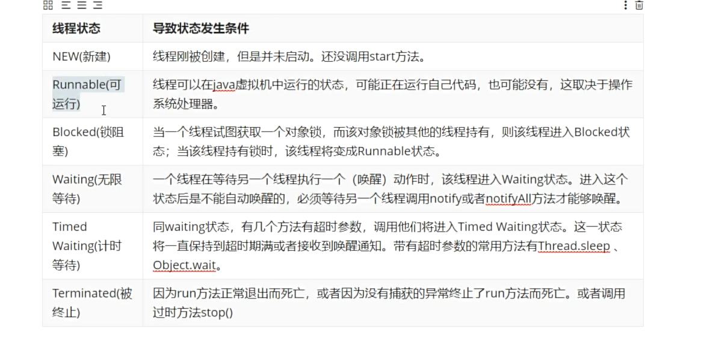
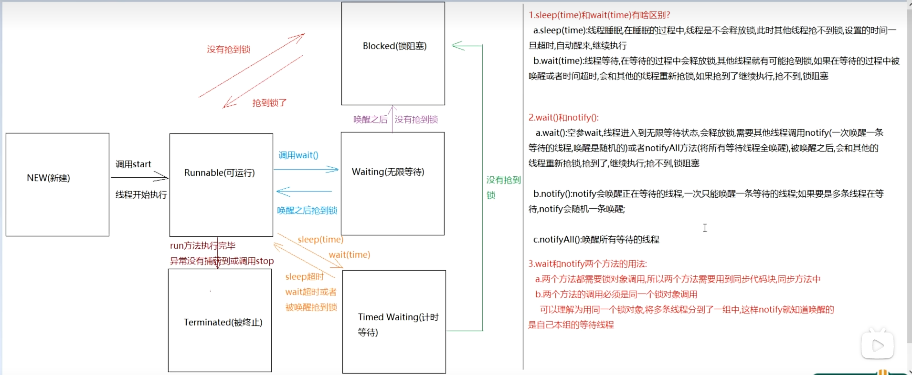

Note 1:   线程安全问题_同步代码块
    原因:CPU在多个线程做高速切换
    解决方法1:使用同步代码块
        1.格式：
            synchronized(任意对象){
                线程可能出现不安全的代码
            }
        2.任意对象:锁对象(eg:两个人抢的一个厕所)
        3.执行:
            一个线程拿到锁后会进入同步代码块中执行，在此期间其他线程拿不到锁进不去同步代码块，
            只能等待有锁的线程执行完后释放锁才能抢锁
    解决方法2:使用同步方法  
        a.普通同步方法(非静态): 修饰符 synchronized(关键字) 返回值类型 方法名 (){
            方法体
            return 结果
        }
        默认锁:this
        b.静态同步方法: 修饰符 static synchronized 返回值类型 方法名 (){
            方法体
            return 结果
        }
        默认锁:class对象

Note 2:   死锁(有可能出现在锁嵌套时)
    介绍两个或两个以上线程竞争同步锁而阻塞的现象，如果没有外力，他们会一直阻塞下去。

Note 3:   线程的状态
   
   
   注意:基本数据类型不能作为锁对象(引用数据类型)，因为他们没有继承Object类，而锁需要支持wait()与notify()等方法，它们定义在Object类中

Note 4: 多线程
    1.等待唤醒机制
        方法:
            void wait()
            void notify()
            void notifyAll()
        案例:一个人包包子，一个人吃包子，但是不能连续包和吃包子。(包一个吃一个)
        问题1:怎么表示包包子和吃包子?   
            a.包包子:count++   b.吃包子:输出count.
        问题2:怎么证明有没有包子?    
            flag=true 表示有包子，false为没有包子.
        问题3:如何防止生产到一半，CPU切换到吃包子的线程?
            加锁.
        问题4:如何解决即使加锁也不能保证包一个吃一个?
            使用wait()与notify()方法.