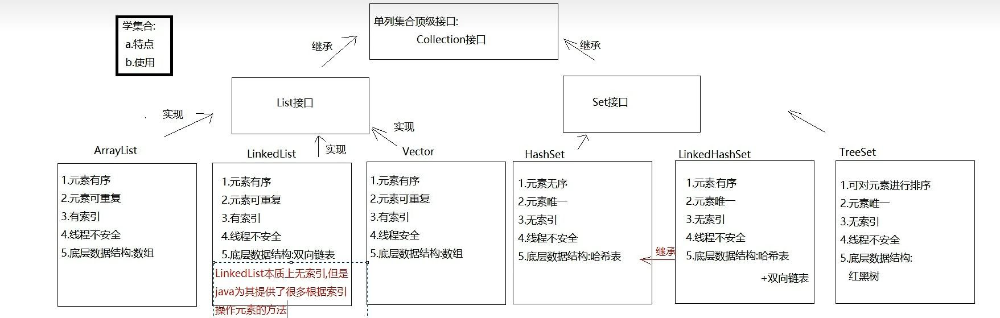
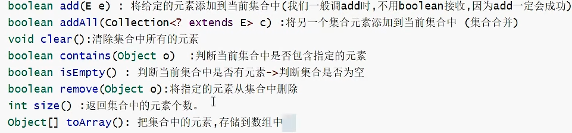
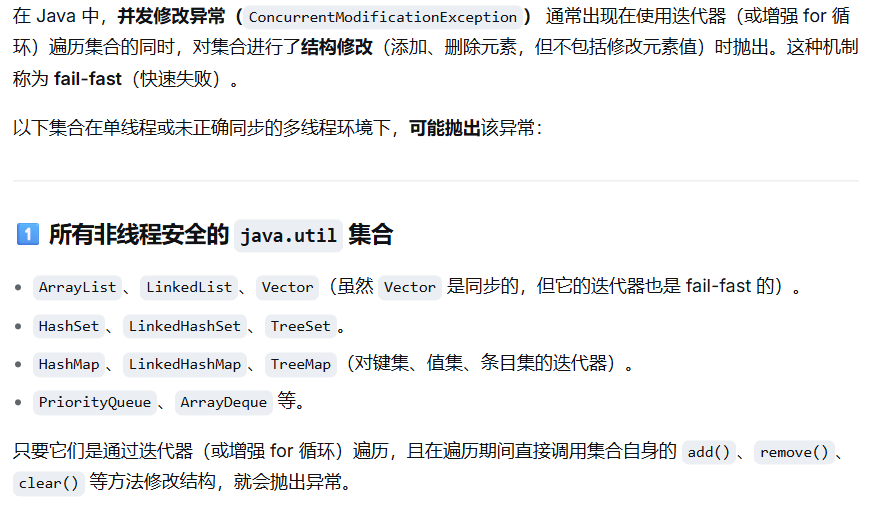
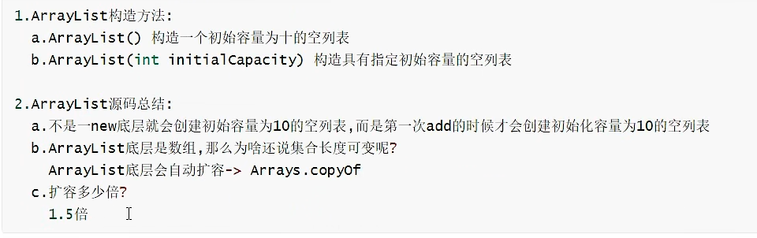
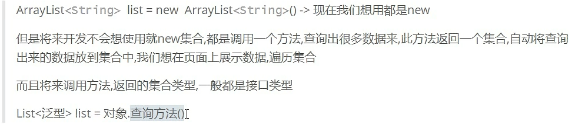
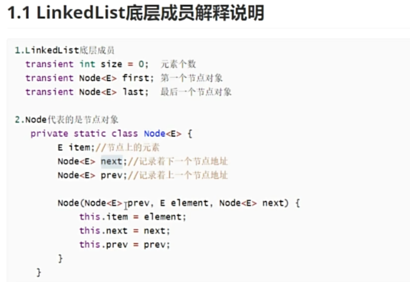
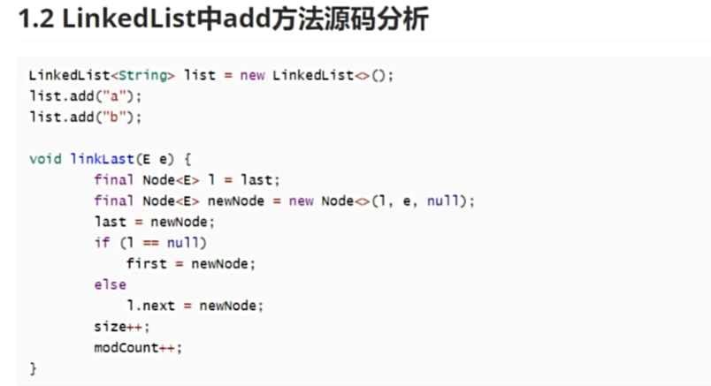
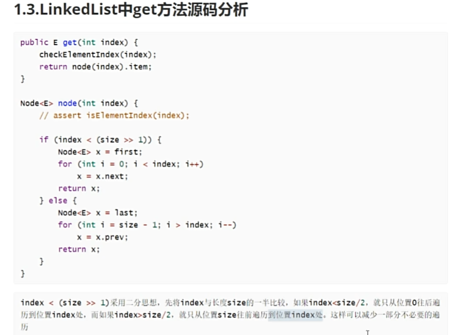

Note 1: 集合
    1.集合的特点:
        a.只能储存引用数据类型
        b.长度可变
        c.集合中有大量的方法可以使用
    2.集合的分类:
        a.单列集合:一个元素就一个组成部分
            eg: list.add("你好")
        b.双列集合:一个元素由两部分组成:key和value(叫做键值对)
            eg: map.put("张三","你好")

Note 2: 单列集合

tips!!!: LinkedList其实本质无索引，只是提供了根据索引进行的方法!

Note 3: Collection接口
    1.概述：单列集合的顶级接口
    2.使用:
        a.创建: Collection<E> 变量名=new 实现类<E>();
        b.<E>:泛型，决定了该集合能储存什么数据类型，只能写引用数据类型，不写默认Object类型，可以储存任意类型
    3.常用方法:
        

Note 4: 迭代器*****
    1.Iterator接口
    2.主要作用:遍历集合
    3.获取:Collection中的方法:
        Iterator<E> iterator();
    4.方法:
        boolean hasNext():判断集合中有没有下一个元素
        E next():获取下一个元素    小细节:最好不要同时next多个元素，除非保证每个next都有检查过hasNext,
                                  不然可能超出集合范围,触发NoSuchElementsException异常
    5.迭代过程:
        int cursor;  //下一个元素索引位置
        int lastRet=-1;  //上一个元素索引位置
    6.并发修改异常
    非线程安全集合不能随意在iterator遍历集合时修改集合长度，会抛出ConcurrentModificationException异常
    原因是他们内部维护了modCount变量(结构的操作次数，如添加删除清空)，而迭代器初始化时会将modCount赋值给expectedModCount(预期操作次数),
    每次迭代器调用next()或remove()时会调用CheckForComodification()检查modCount==expectedModCount,不等就抛出ConcurrentModificationException异常,而任何直接调用集合的 add()、remove()、clear() 等方法，都会使 modCount++,但迭代器中的expectedModCount却不变。
    不过迭代器自己的 remove() 方法会在删除后同步更新 expectedModCount，所以不会抛异常。
    

Note 5: 数据结构
    1.栈:先进后出
    2.队列:先进先出
    3.数组:有索引所以查询快；数组定长所以增删慢
    4.链表:  查询慢，增删快
        a.单向链表
            1.一个节点分为两个部分:数据域(存数据)和指针域(保存下一个节点地址)
            2.特点:前节点保存后一个节点地址，但后一个不保存前面的地址，因此为单向

        b.双向链表
            1.一个节点分为三个部分:指针域(上一个节点地址)、数据域(存数据)、指针域(下一个节点地址)
            2.特点:前后节点地址都保存

Note 6: List接口*****
    1.是单列集合顶级接口Collection接口的子接口
    2.常见的实现类: ArrayList LinkedList Vector(太老不多了解)
    一、ArrayList类
        1.概述:是List接口的实现类
        2.特点:
            a.元素有序:什么顺序存，就什么顺序取
            b.元素可重复
            c.有索引:可根据索引查找
            d.线程不安全
        3.数据结构:数组
        4.常用方法:
            boolean add(E e)                    将元素添加到集合的尾部(add方法一定能添加成功的，所以我们不用boo1ean接收返回值)
            void add(int index，E element)      在指定索引位置上添加元素
            boolean remove(object o)            删除指定的元素，删除成功为true，失败为false
            E remove(intindex)                  删除指定索引位置上的元素，返回的是被删除的那个元素
            E set(int index，Eelement)          将指定索引位置上的元素，修改成后面的element元素
            E get(int index)                    根据索引获取元素
            int size()                          获取集合元素个数
        5.底层源码分析:
        
        以后开发中注意:
        
    二、LinkedList类
    1.概述:List的实现类
    2.特点:
        a.元素有序:什么顺序存，就什么顺序取
        b.元素可重复
        c.有索引:只是有操作索引的方法,并不是本质上有索引
        d.线程不安全
    3.数据结构:双向链表
    4.常用方法:有大量直接操作首位元素的方法
        public void addFirst(E e):将指定元素插入此列表的开头。
        public void addLast(E e):将指定元素添加到此列表的结尾。
        public E getFirst():返回此列表的第一个元素。
        public E getLast():返回此列表的最后一个元素。
        public E removeFirst():移除并返回此列表的第一个元素。
        public E removeLast():移除并返回此列表的最后一个元素。
        public E pop():从此列表所表示的堆栈处弹出一个元素。底层直接return removeFirst();
        public void push(E e):将元素推入此列表所表示的堆栈。底层直接return addFirst();
        public boolean isEmpty():如果列表没有元素,则返回true.
    5.底层源码分析:
    
    
    

Note 7: 增强for*****
    1.作用遍历数组或集合
    2.使用:
        for(变量类型 变量名: 要遍历的数组名或集合名){
            变量名就是代表的遍历的每一个元素
        }//实例见DemoLinkedlist.java中最后一种遍历方式
    3.快捷键:集合(数组)名.for
    4.注意:
        a.遍历集合时,增强for底层实现原理是迭代器，所以遍历过程中不能随意修改集合长度，否则会出现并发修改异常
        b.遍历数组时,增强for底层实现原理是普通for

Note 8: Collections集合工具类
    1.概述：集合工具类
    2.特点：
        a.构造私有
        b.方法都是静态的
    3.使用:都是类名直接调用
    4.方法:
        static <T> bollean addAll()(Collection<? super T> c, T... elements)     批量添加元素
        static void shuffle(List<?> list)       将集合中的元素打乱
        static <T> void sort(List<T> list)      将集合中的元素按照默认规则排序->按照第一个字符的ASXII码表
        static <T> void sort(List<T> list,Comparator<? super T> c)      将集合中的元素按照指定规则排序

    扩展Arrays中的一个静态方法
        static <T> List<T> asList(T...a)        直接将指定元素转存到list集合中

