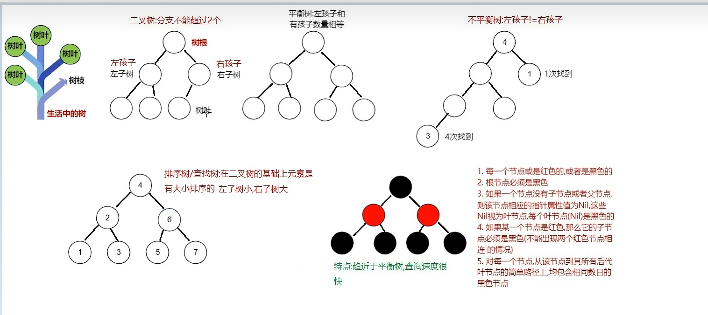
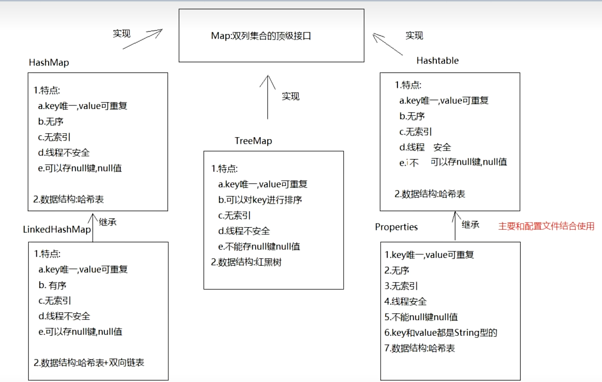
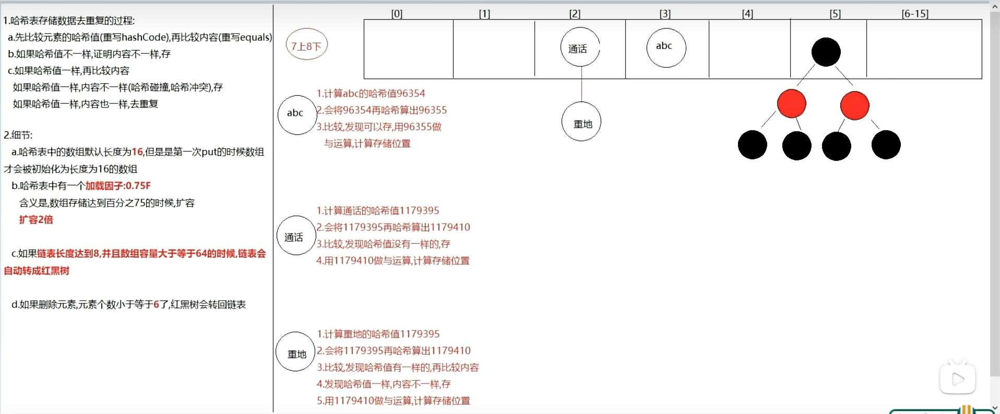
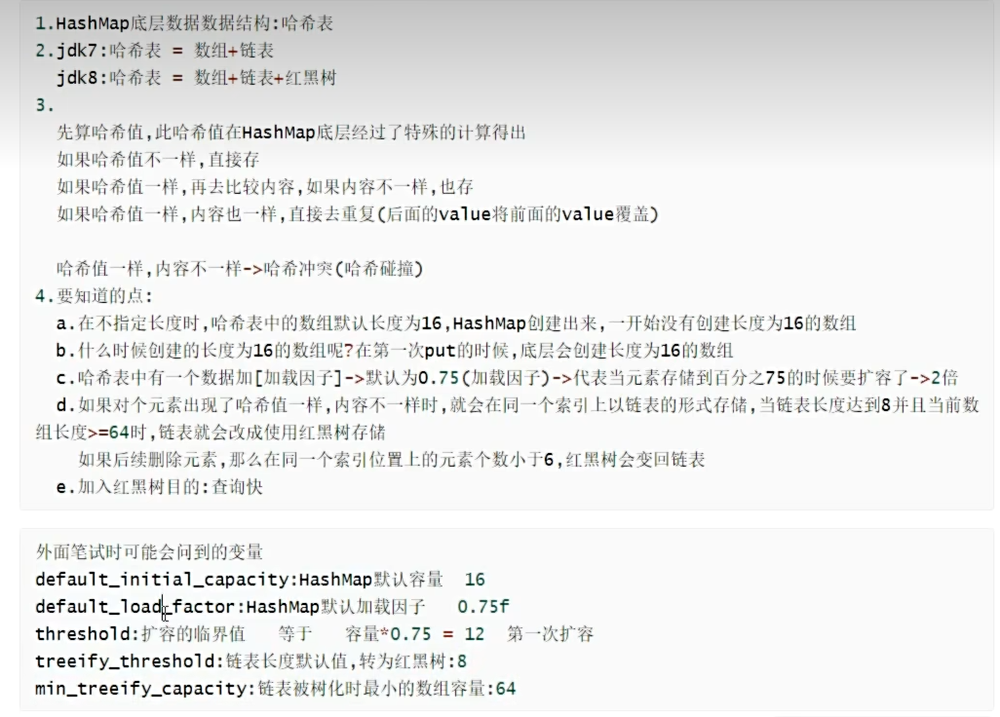
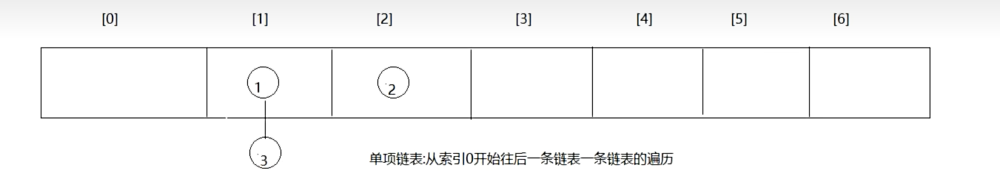
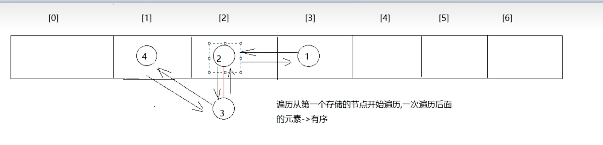

-------------第三章:红黑树-------------
Note 1:  红黑树
    1.集合加入红黑树的目的:提高查询效率
        HashSet集合:
            数据结构:哈希表
            哈希表=数组+链表+红黑树
    2.什么是红黑树
    

-------------第四章:Set集合-------------
Note 2:  Set接口******
    1.Set接口并没有对Collection接口进行功能上的扩充,而且所有的Set集合底层都是依靠Map实现,没有自己的东西,相当于傀儡
    2.Set与Map密切相关的,Map的遍历需要先变成单列集合,只能变成Set集合

Note 3:  HashSet集合******
    1.概述:HashSet是Set接口的实现类
    2.特点:
        a.元素唯一
        b.元素无序
        c.无索引
        d.线程不安全
    3.数据结构:哈希表
    4.方法:和Collection一样
    5.遍历:
        a.增强for
        b.迭代器

Note 4: LinkedHashSet集合******
     1.概述:LinkedHashSet extends HashSet
    2.特点:
        a.元素唯一
        b.元素有序
        c.无索引
        d.线程不安全
    3.数据结构:哈希表+双向链表
    4.方法:和HashSet一样
    5.遍历:
        a.增强for
        b.迭代器

Note 5:  哈希值******
    1.概述:是由计算机算出来的十进制数,可以看作是对象的地址值
    2.获取对象的哈希值,用的是Object的方法
        public native int hashCode()
    3.如果重写了hashCode()方法,那计算的就是对象内容的哈希值了
    4.总结:
        a.哈希值不一样,内容肯定不一样
        b.哈希值一样,内容也有可能不一样
        c.如果不重写hashCode()方法,默认计算对象的哈希值
        d.如果重写了hashCode()方法,那计算的就是对象内容的哈希值了

Note 6:  Set集合的存储去重复过程
    1.先计算元素的哈希值(重写hashCode方法),再比较内容(重写equals方法)
    2.先比较哈希值,如果哈希值不一样,存
    3.如果哈希值一样
        a.内容不一样,存
        b.内容一样,去重复
    4.如果Set集合存储自定义类型,该如何去重复?
        重写hashCode()与equals()方法,让HashSet去比较对象属性的哈希值与对象属性的内容
        如果不重写hashCode()与equals()方法,默认调用的是Object中的,不同的对象,哈希值肯定不一样,equals比较的对象地址值也不一样,
        所以此时即使对象的属性值一样也不能去重复

                二十章Map集合:Map集合_TreeSet_TreeMap_HashTable与Vector集合_Properties集合(属性集)_集合嵌套_哈希表结构储存过程
===============================================================================================================================
-------------第一章:Map集合-------------
Note 7:   双列集合
    1.双列集合框架:
        

Note 8:   Map的介绍
    1.是双列集合的顶级接口
    2.元素都是由key(键),value(值)组成键值对

Note 9:   HashMap的介绍和使用
    1.概述:HashMap是Map的实现类
    2.特点:
        a.key唯一,value可重复;如果key重复了会发生value覆盖
        b.无序
        c.无索引
        d.线程不安全
        e.可以存null键null值
    3.数据结构:哈希表
    4.方法:
        V put(K key,V value)->添加元素,返回的是
        V remove(Object key) ->根据key删除键值对,返回的是被删除的value
        V get(Object key)-> 根据key获取value
        boolean containsKey(Object key)-> 判断集合中是否包含指定的key
        Collection<V> values() -> 获取集合中所有的value,转存到col1ection集合中
    5.遍历方式:
        Set<K> keySet()->将Map中的key获取出来,转存到Set集合中
        Set<Map.Entry<K,V>> entrySet()->获取Map集合中的键值对,转存到set集合中
 
Note 10:LinkedHashMap
    1.概述:LinkedHashMap extends HashMap
    2.特点:
        a.key唯一,value可重复;如果key重复了会发生value覆盖
        b.有序
        c.无索引
        d.线程不安全
        e.可以存null键null值
    3.数据结构:哈希表+双向链表
    4.方法:与HashMap一样

Map集合练习一:
    输入字符串,统计字符串包含字符数量

Map集合练习二:
    斗地主

-------------第二章:哈希表结构储存过程-------------
Note 11:哈希表结构储存过程
    如果key为自定义类型,去重复的话,重写hashCode与equals()方法,去重复过程和Set集合一样
    因为Set集合的元素到了底层都是保存到map的key位置上.
    
    

Note 12:哈希表无索引&哈希表有序无序详解:
    1.哈希表是数组+链表,为什么却是无索引的?
        因为存数据的时候可能同一个索引下形成链表.如果按照索引取该获取哪个元素呢,因此取消了索引机制.
    2.为啥说HashMap无序,LinkedHashMap是有序的
        因为HashMap底层哈希表为单向链表,而LinkedHashMap底层在哈希表的基础上加了双向链表
        
        

-------------第三章:TreeSet-------------
Note 13:  TreeSet(单列集合)
    1.概述:TreeSet是Set的实现类
    2.特点:
        a.对元素进行排序
        b.无索引
        c.不能存null
        d.线程不安全
        e.元素唯一
    3.数据结构:红黑树
    4.构造:
        TreeSet()                                  构造一个新的空Set,该Set根据元素的自然顺序进行排序--ASCII
        TreeSet(Comparator<? super E> comparator)  构造一个新的空TreeSet,他根据指定比较器进行排序

-------------第四章:TreeMap-------------

