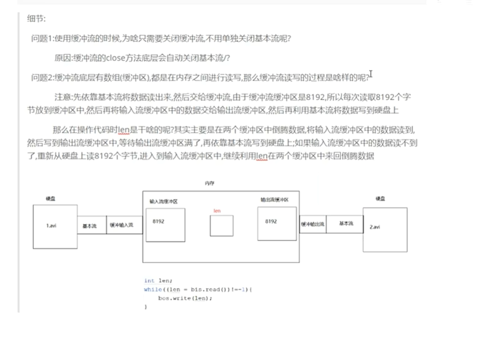
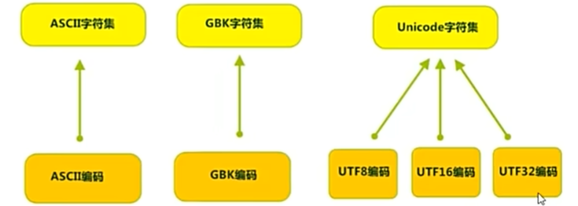
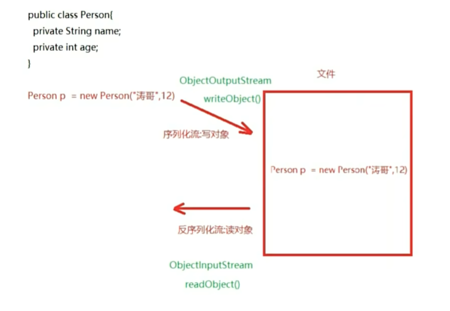
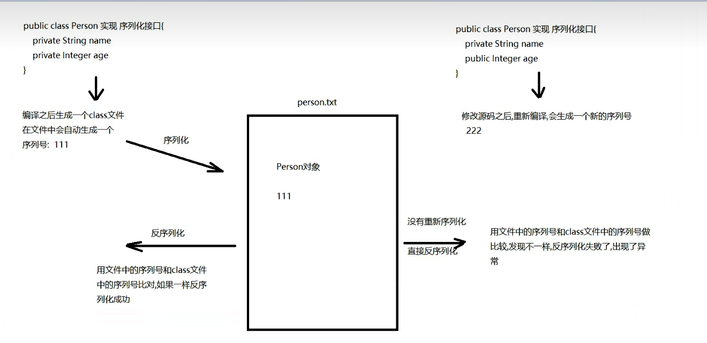

                二十一章IO流:File流、字节流、字符流
===============================================================================================================================
分隔符:
    a.路径名称分隔符
        Windows:\          注:Java中一个'\'代表转义字符,因此写路径时应该是"\\",前一个'\'将后一个'\'转译成普通'\'，就是正确的路径了
        Linux:/
    b.路径分隔符  ;

-------------第一章:File流-------------
Note 1:File流
    1.概述:文件和目录(文件夹)路径名的抽象表示
    2.简单理解:创建File对象时,需要传递一个路径,该路径定位到哪个文件或文件夹,该File对象就代表哪个
    3.File的静态成员
        static String pathSeparator:与系统有关的路径分隔符,为了方便,他被表示为一个字符串    ;
        static String separator:与系统有关的默认名称分隔符,为了方便,他被表示为一个字符串    \ /
            在往后Java开发中路径可能会这样写: String path="E:\\Code\\Java\\Intern\\week8\\Note.md";
            但有个问题,这样写只在Windows生效如果Linux呢?我们可以这样:
            String path="E:"+File.separator+"Code"+File.separator+"Java"......+File.separator+"Note.md";
    4.File的构造方法:    
        File(String parent,String child)    根据所填写的路径创建File对象
            parent:父路径           child:子路径
        File(File parent,String child)      根据所填写的路径创建File对象
            parent:父路径,是一个File对象           child:子路径
        File(String pathname)               根据所填写的路径创建File对象
            pathname:直接指定路径
    5.File的常用方法:
        a.获取方法:
            String getAbsolutePath()    :获取File的绝对路径(带盘符的路径)  //如果没有盘符,他会在前面自动补充当前项目的路径
            String getPath()            :获取的是封装路径(new对象写的啥路径就是什么路径)
            String getName()            :获取的是文件或文件夹的名称
            long length()               :获取的是文件的长度(文件的字节数)
        b.创建方法:
            boolean createNewFile()     :创建文件
                如果要创建的文件之前有,创建失败,返回false
                如果要创建的文件之前没有,创建成功,返回true
            boolean mkdirs()             :创建文件夹(目录)既可以创建多级文件夹,还可以创建单级文件夹
                如果要创建的文件夹之前有,创建失败,返回false
                如果要创建的文件夹之前没有,创建成功,返回true
    6.File的删除方法:
        boolean delete()                :删除文件或文件夹
            慎用：a.删除了文件或文件夹不会进回收站  b.文件夹只能是空文件夹才能删除
    7.File的判断方法:
        boolean isDirectory()           :判断是否为文件夹
        boolean isFile()                :判断是否为文件
        boolean exists()                :判断文件或文件夹是否存在 
    8.File的遍历方法:
        String[] list()                 :遍历指定文件夹,返回的是String数组
        File[] listFiles()              :遍历指定文件夹,返回的是File数组(这个推荐使用)
            细节:listFiles方法底层还是用list方法,先调用list方法得到一个String数组，遍历数组将内容一个一个封装到
            File对象中,再将所有File对象放入File数组并返回.
    9.Practice：遍历指定文件夹下所有.jpg文件
        a.创建File对象,指定要遍历的文件夹
        b.调用listFiles(),遍历文件夹,返回File数组
        c.遍历File数组,在遍历过程中判断,如果是文件,获取文件名,判断是否以.jpg结尾的,如果是则输出
        d.否则是文件夹,递归重复2 3 4步骤.
    10.相对路径与绝对路径
        1.绝对路径:从盘符开始写的路径
            E:\\idea\\io\\1.txt
            如:我要写信给美国的朋友,地址要写清楚美国(盘符)哪个州哪个区
        2.相对路径:不从盘符开始写的路径
            如:我要写信给国内的朋友写信,地址就不用写中国(盘符)了，直接写哪个省哪个区
        3.针对idea中写相对路径:
            口诀:哪个路径是参照路径,哪个路径就可以省略不写,剩下的就是在idea中的相对路径写法
                idea中的参照路径：当前projrct的绝对路径

-------------第二章:IO流-------------*****************
Note 2:IO流介绍以及输入输出以及流向的介绍
    1.单词:
        Output:输出
        Input:输入
        write:写数据
        read:读数据
    2.IO流:
        将一个设备的数据传输到另外一个设备上的技术
    3.作用:
        a.之前学的集合与数组存储的数据是临时数据(保存在内存当中,代码运行完就消失),而IO流可以将数据存储到硬盘中
        b.将来传输数据,也必然用到输入与输出
    4.IO的流向
        参照物:内存
        Output:从内存里出去
        Input:进到内存里
    5.IO流分类
        a.字节流:万能流,因为一切皆字节
            字节输出流:OutputStream 抽象类
            字节输入流:InputStream 抽象类
        b.字符流:专门操作文本文档
            字符输出流:Writer 抽象类
            字符输入流:Reader 抽象类

-------------第三章:字节流-------------*****************
Note 3: FileOutputStream
    1.概述:字节输出流OutputStream的子类FileOutputStream
    2.作用:向硬盘写数据
    3.构造
        FileOutputStream(File file)
        FileOutputStream(String name)
    4.特点:
        a.指定的文件如果没有,输出流会自动创建一个
        b.每执行一次,默认都会创建一个新的文件,覆盖老文件
    5.方法:
        void write(int b)       一次写一个字节
        void write(byte[] b)   一次性将b数组写入                    
        void write(byte[] b, int off,int len)   从b数组的off索引开始写len个
        void close()        关闭输出流
    6.字节流的扩写功能:
        a.FileOutputStream(String name,boolean append)    
            append->为true时,可以实现写入文件时不用覆盖旧文件，而是直接从后面续写
        b.换行符:
            windows: "\r\n" ->占两个字节 或者  "\n"也行
            Linux:   "\n"
            mac os:  "\r"

Note 4: FileInputStream
    1.概述:字节输入流InputStream的子类FileOutputStream
    2.作用:读数据,从硬盘读数据
    3.构造
        FileInputStream(File file)
        FileInputStream(String name)
    4.方法:
        int read(int b)       一次读一个字节,返回的是读取的字节;文件到达了末尾,返回-1
        int read(byte[] b)   一次性读取一个数组,返回的是读取的字节个数 ，到达文件末尾依旧返回-1              
        int read(byte[] b, int off,int len)   从b数组的off索引开始读len个,返回的是读取的字节个数
        void close()        关闭输入流

-------------第四章:字符流-------------*****************
    字节流读取中文问题: GBK一个汉字两字节，而UTF-8占3字节，字节流边读边看可能存在问题，因此更侧重于文件复制而非边读边看
    解决:按照字节去操作文档可能会乱码(可能字节数对不上)，因此按照字符数来操作,但是注意编码也要一致

Note 5: FileReader
字符流专门操作文本文档，但复制一定不要用字符流而是用字节流
    1.字符输入流:Reader(抽象类),其子类就是FileReader
    2.作用:将文本内容读取到内存
    3.构造:
        FileReader(File file)
        FileReader(String fileName)
    4.方法:
        int read(int b)       一次读一个字符,返回的是读取的字符对应ASCII;文件到达了末尾,返回-1
        int read(char[] cbuf)   一次性读取一个字符数组,返回的是读取的字符个数 ，到达文件末尾依旧返回-1              
        int read(char[] cbuf, int off,int len)   从b字符数组的off索引开始读len个,返回的是读取的字符个数
        void close();       关闭输入流

Note 6: FileWriter
    1.字符输出流:Writer(抽象类),其子类就是FileWriter
    2.作用:将数据写到文件中
    3.构造:
        FileWriter(File file)
        FileWriter(String fileName)
        FileWriter(String fileName,boolean append)
            append->为true时,可以实现写入文件时不用覆盖旧文件，而是直接从后面续写
    4.方法:
        void write(int b)       一次写一个字符
        void write(char[] cbuf)   一次性将字符数组写入                    
        void write(char[] cbuf, int off,int len)   从字符数组的off索引开始写len个
        void write(String str)      直接写入一个字符串
        void flush()        刷新流(字符输出流较为特殊，自带一个缓冲区，我们写入的字符都临时存在缓冲区中，需刷新才能真正写入硬盘)
        void close()        关闭输出流(自带调用flush方法)

-------------第五章:IO异常处理方式-------------
Note 7:IO异常处理方式
    1.JDK7之前处理方式见ResolveIOExp.JDK7before.java
    2.JDK7开始及之后处理方式见ResolveIOExp.JDK7after.java
        a.格式:
            try(IO对象){ //括号中可new多个对象,用分号隔开
                可能出现异常的代码
            }catch(异常类型 对象名){
                处理异常
            }
        b.注意:以上IO对象会自动调用close关流
    3.另外值得一提的一个小优化是从JDK9开始，try-with-resources 变得更加灵活。如果资源变量已经在外部使用
    final修饰或者实际是final的，你可以直接在try语句的括号()里引用它，无需再重新声明如 try(fw;fr){}   //前提是fw与fr是final的

-------------第六章:字节字符缓冲流-------------
    为啥要学缓冲流:
        之前所写的FileOutputStream, FileInputStream, FileReader, FileWriter 这都叫做基本类，其中FileInputStream
        和FileOutputStream的读写方法都是本地方法（方法声明上带native），本地方法是和系统以及硬盘打交道的，也就是说这两个对象
        的读和写都是在硬盘之间进行读写的，效率不高；缓冲流中底层带一个长度为8192的数组（缓冲区），此时读和写都是在内存中完成的（
        在缓冲区之间完成），内存中的读写效率非常高.
        使用之前需要将基本流包装成缓冲流，本质就是new对象时传递基本流

Note 8:字节缓冲流
    a.BufferedOutputStream:字节缓冲输出流
        1.构造:BufferedOutputStream(OutputStream out)
        2.使用:和FileOutputStream一样
    a.BufferedInputStream:字节缓冲输入流
        1.构造:BufferedInputStream(InputStream in)
        2.使用:和FileInputStream一样
    细节:
Note 9:字符缓冲流
    a.我们知道字符流的基本流的底层是有缓冲区的，所以效率差别不明显，但是不代表字符缓冲流不重要，因为我们要主要学习它的两个特有方法
    b. BufferedWriter:字符缓冲输出流
        1.构造:BufferedWriter(Writer w)
        2.使用:和FileWriter一样
        3.特有方法:
            newLine()
    c.BufferedReader:字符缓冲输入流
        1.构造:BufferedReader(Writer w)
        2.使用:和FileReader一样
        3.特有方法:
            String readLine()   一次读一行，如果读到结束标记，返回的是null,读取很方便

-------------第七章:转换流、序列化流、打印流_PrintStream(了解)-------------
Note 10:转换流
    介绍:
        字符编码(Character Encoding):就是一套自然语言的字符与二进制数之间的对应规则.
        编码:按照某则规则将字符存储在计算机中
        解码:按照某种规则将计算机中的二进制数解析出来
        乱码:编码与解码规则不同不兼容时出现的乱码现象
        计算机要精准的存储和识别各种字符集符号，需要进行字符编码，一套字符集必然至少有一套字符编码.
        常见字符集有:ASCII、GBK、Unicode等字符集
        
        可见，当指定了编码，它所对应的字符集自然就确定了，所以编码才是我们最重要关心的
        记住:UTF-8中一个汉字占3个字节,GBK中一个汉字占2个字节
    1.InputStreamReader
        a.概述:是字节流通向字符流的桥梁->读数据
        b.构造:
            InputStreamReader(InputStream in,String charset)    charset:指定编码，不区分大小写
        c.作用:可以指定编码，按照指定编码去读取内容
        d.用法:基本用法与FileReader一样(FileReader继承了InputStreamReader)
    2.OnputStreamWriter
        a.概述:是字符流通向字节流的桥梁->写数据
        b.构造:
            OutputStreamWriter(OutputStream out,String charset)    charset:指定编码，不区分大小写
        c.作用:可以指定编码，按照指定编码去存储数据
        d.用法:基本用法与FileWriter一样(FileWriter继承了OutputStreamWriter)

Note 11:序列化流与反序列化流
    为什么要序列化:因为将一个对象实现序列化接口，将来才能让这个对象变成二进制文件在网络上传输
    1.作用:读写对象(Object对象)
    2.两个对象:
        a.ObjectOutoutStream->序列化流->写对象
        b.ObjectInputStream->反序列化流->读对象
    3.注意:我们将对象序列化到文件中，打开文件我们看不懂很正常，我们只需将这些看不懂的内容成功读取回来即可
        应用场景:游戏的英雄存档，退出时英雄变成对象，将人物的属性变成对象的成员变量，然后存到文件，等待下次打开游戏反序列化读取人物属性还原
    
    4.序列化流_ObjectOutoutStream
        a.作用:写对象
        b.构造:
            ObjectOutputStream(OutputStream out)
        c.方法:
            void writeObject(Object object)     写对象
        d.注意:想要将对象序列化到文件中，被序列化的对象需要实现Serializable接口
    5.反序列化流_ObjectInputStream
        a.作用:读对象
        b.构造:
            ObjectInputStream(InputStream in)
        c.方法:
            Object readObject()     读对象
        d.注意:想要将对象序列化到文件中，被序列化的对象需要实现Serializable接口
    6.如果不想对象的某个属性被序列化(了解)
        将该属性有transient
    7.反序列化时出现的问题以及分析和解决
        a.问题描述:序列化之后，修改源码，修改后没有重新序列化，直接反序列化，就会出现序列号冲突问题:InvalidClassException
            
            解决:将序列号定死即可，后面不论怎么修改源码，序列号都是这一个
            方法:在被序列化的对象加上一个public static final long serialVersionUID 的变量并
                为其赋值只要这个值不变，JAVA就会认为类的版本一致
        b.问题描述:循环读取的次数和存储对象的个数不对应，就会出现EOFException
            解决:直接序列化一个对象的集合而非多个对象，于是反序列化一个集合就可以通过集合取出所有对象

