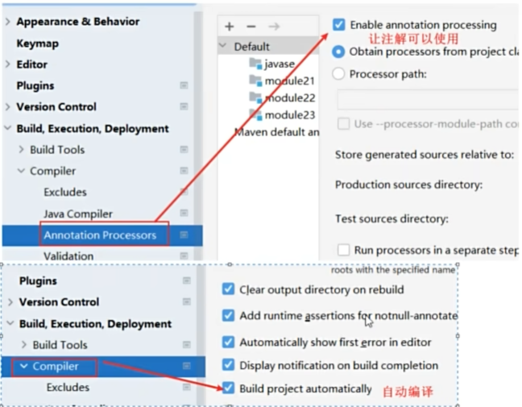
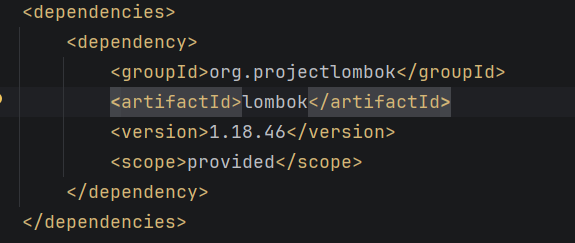

                二十三章IO流:网络编程_正则表达式_设计模式
# 第一章  网络编程
## 1.网络编程
- 计算机之间通过网络传输数据
- 软件结构
   - C/S结构:Client/Server    指客户端/服务端结构，常见的有:QQ/微信
     - 优势:服务器压力小
     - 缺点:不好维护(客户端端分离,客户端开发人员开发,服务器开发人员维护)
   - B/S结构:Browser/Server   指浏览器/服务器,常见浏览器有:Chrome/Firefox/IE
     - 优点:好维护
     - 缺点:服务器压力大
## 2.服务器
- 服务器:安装了服务器软件的计算器
- 服务器软件:tomcat
- 网络通信协议:两台计算机在做数据交互时要遵守的规则,协议会对数据的格式,速率等进行规定,只有都遵守了这个协议,才能完成数据交互.
  两台计算机想完成数据交互,需要遵守网络通信协议
## 3.通信三要素

### [IP地址]：计算机的唯一标识，用于两台计算机之间的连接

#### a. 概述
指互联网协议地址（Internet Protocol Address），俗称IP  
计算机的唯一标识

#### b. 作用
可用于计算机和计算机之间的连接

#### c. IPV4
32位的二进制数，通常被分为4个字节，表示成`a.b.c.d`的形式，例如`192.168.65.100`。其中a、b、c、d都是0~255之间的十进制整数，最多可以表示约42亿个地址。

**IPV6**
为了扩大地址空间，拟通过IPv6重新定义地址空间，采用128位地址长度，每16个字节一组，分成8组十六进制数，表示成`ABCD:EF01:2345:6789:ABCD:EF01:2345:6789`，号称能给地球上的每一粒沙子分配一个IP地址。

#### d. 相关命令
- 查看ip的命令：`ipconfig`
- 测试是否能连接其他计算机的命令：`ping ip地址`

#### e. 特殊的网址
代表的是本机地址，到了哪里都不会变，代表自己
- 127.0.0.1
- localhost
  - localhost(主机名，写的是服务器的ip地址):端口号/应用名称/资源
  - 如果是8080端口，则访问localhost:8080/应用名称/index.html 

### [协议]

#### TCP：面向连接协议
需要先确认连接，才能进行数据交互

**三次握手：**
- 第一次握手：客户端向服务器端发出连接请求，等待服务器确认。
- 第二次握手：服务器端向客户端回送一个响应，通知客户端收到了连接请求。
- 第三次握手：客户端再次向服务器端发送确认信息，确认连接。

- 好处：数据安全，能给数据的传输提供一个安全的传输环境
- 坏处：效率低

---

#### UDP：面向无连接协议
- 好处：效率高
- 坏处：传输的数据不安全，容易丢失数据包

---

#### [端口号]
- 每一个应用程序的唯一标识
- 用两个字节表示的整数，取值范围是 0~65535。其中，0~1023 之间的端口号用于一些知名的网络服务和应用，普通的应用程序需要使用 1024 以上的端口号。如果端口号被另外一个服务或应用所占用，会导致当前程序启动失败。

#### [TCP协议中的三次握手和四次挥手]

- 三次握手
  - 第一次握手：客户端向服务器端发出连接请求，等待服务器确认。
  - 第二次握手：服务器端向客户端回送一个响应，通知客户端收到了连接请求。
  - 第三次握手：客户端再次向服务器端发送确认信息，确认连接。
- 四次挥手
  - 第一次挥手：客户端向服务器端提出结束连接，让服务器做最后的准备工作。此时，客户端处于半关闭状态，即表示不再向服务器发送数据了，但是还可以接受数据。
  - 第二次挥手：服务器接收到客户端释放连接的请求后，会将最后的数据发给客户端，并告知上层的应用进程不再接收数据。
  - 第三次挥手：服务器发送完数据后，会给客户端发送一个释放连接的报文。客户端接收后就知道可以正式释放连接了。
  - 第四次挥手：客户端接收到服务器最后的释放连接报文后，要回复一个彻底断开的报文。服务器收到后才会彻底释放连接。客户端发送完最后的报文后，会等待2MSL，因为有可能服务器没有收到最后的报文，那么服务器迟迟没收到，就会再次给客户端发送释放连接的报文，此时客户端在等待时间范围内接收到，会重新发送最后的报文，并重新计时。如果等待2MSL后，没有收到，那么彻底断开。

## 4. UDP协议编程

### 核心对象类比
1. `DatagramSocket` → 好比寄快递找的快递公司
2. `DatagramPacket` → 好比快递公司打包

---

### 4.1 发送端步骤
1. **创建 `DatagramSocket` 对象（快递公司）**
    - a. 空参：端口号从可用的端口号中随机一个使用
    - b. 有参：自己指定端口号

2. **创建 `DatagramPacket` 对象，将数据进行打包**
    - a. 要发送的数据 → `byte[]`
    - b. 指定接收端的 IP 地址
    - c. 指定接收端的端口号

3. **发送数据**
4. **释放资源**

### 4.2 接收端步骤
1. **创建 `DatagramSocket` 对象,指定服务端接收端口**
2. **接收数据包**
3. **解析数据包**
4. **释放资源**


## 5.TCP协议编程


### 5.1 编写客户端
1. **创建 `Socket` 对象,指定服务端的ip与端口**
2. **调用 `Socket` 对象中的 `getOutputStream()` 方法获取网络输出流,往服务端发送请求**
3. **调用 `Socket` 对象中的 `shutdownOutput()` 方法写入一个结束标记，用于告诉服务端不用继续等待读取,客户端的写入已经结束**
4. **调用`Socket`对象中的 `getInputStream()` 方法获取网络输入流,读取服务端响应的数据**
5. **关流**

### 5.2 编写服务端
1. 创建 `ServerSocket` 对象，设置端口号
2. 调用 `ServerSocket` 中的 `accept()` 方法，等待客户端连接，返回 `Socket` 对象
3. 调用 `Socket` 中的 `getInputStream()`，用于读取客户端发送过来的数据
4. 调用 `Socket` 中的 `getOutputStream()`，用于给客户端响应数据
5. 关闭资源

# 第二章 正则表达式
## 1. 概述
1. 正则表达式，也叫正则，是一种描述特殊规则的字符串。
2. 作用:校验,比如校验手机号、邮箱、用户名、密码等
3. String中有一个方法叫`matches()`，可以判断字符串是否符合正则表达式的规则
- `boolean matches(String regex)`; 检验字符串是否符合指定`regex`的规则

## 2. 正则表达式-字符类
- `java.util.regex.Pattern`：正则表达式的编译表示形式。
- 正则表达式-字符类：`[]` 表示一个区间，范围可以自定义。
### 语法示例
1. `[abc]`：代表 `a` 或者 `b` 或者 `c` 字符中的一个。
2. `[^abc]`：代表除 `a`, `b`, `c` 以外的任何字符。
3. `[a-z]`：代表 `a` 到 `z` 的所有小写字符中的一个。
4. `[A-Z]`：代表 `A` 到 `Z` 的所有大写字符中的一个。
5. `[0-9]`：代表 `0` 到 `9` 之间的某一个数字字符。
6. `[a-zA-Z0-9]`：代表 `a-z` 或者 `A-Z` 或者 `0-9` 之间的任意一个字符。
7. `[a-dm-p]`：`a` 到 `d` 或 `m` 到 `p` 之间的任意一个字符。

## 3. 正则表达式-逻辑运算符
### 语法示例
1. `|`：逻辑或，匹配 `a` 或者 `b` 中的任意一个。
2.  `&&` ：逻辑与，匹配 `a` 和 `b` 都匹配。

## 4. 正则表达式-预定义字符
### 语法示例
1. `.`：匹配任何字符。（重点）不能加 `[]`
2. `\\d`：任何数字 `[0-9]` 的简写；（重点）
3. `\\D`：任何非数字 `[^0-9]` 的简写；
4. `\\s`：空白字符：`[ \t\n\x0B\f\r]` 的简写
5. `\\S`：非空白字符：`[^\\s]` 的简写
6. `\\w`：单词字符：`[a-zA-Z_0-9]` 的简写（重点）
7. `\\W`：非单词字符：`[^\\w]`

## 5. 正则表达式-数量词
### 语法示例（`x` 代表字符）
1. `X?`：`x` 出现的数量为 **0次或1次**
2. `X*`：`x` 出现的数量为 **0次到多次（任意次）**
3. `X+`：`x` 出现的数量为 **1次或多次（`x >= 1` 次）**
4. `X{n}`：`x` 出现的数量为 **恰好 `n` 次（`x = n` 次）**
5. `X{n,}`：`x` 出现的数量为 **至少 `n` 次（`x >= n` 次）**，例如 `x{3,}`
6. `X{n,m}`：`x` 出现的数量为 **`n` 到 `m` 次（`n` 和 `m` 都包含，`n <= x <= m`）**

## 6. 正则表达式-分组括号()
### 语法示例 (abc)
```java
private static void method05() {
    //检验"abc"可以一起出现无数次
    boolean result01="abcabc".matches("(abc)*");
    System.out.println(result01);
}
```

## 7. String 类中和正则表达式相关的方法
- `boolean matches(String regex)`：判断字符串是否匹配给定的正则表达式。
- `String[] split(String regex)`：根据给定正则表达式的匹配拆分此字符串。
- `String replaceAll(String regex, String replacement)`：把满足正则表达式的字符串，替换为新的字符。

## 8. 正则表达式生成网址
- https://www.sojson.com/regex/generate


# 第三章 设计模式

设计模式（Design pattern），是一套被反复使用、经过分类编目的、代码设计经验的总结，使用设计模式是为了可重用代码、保证代码可靠性、程序的重用性、稳定性。

1995 年，GoF（Gang of Four，四人组）合作出版了《设计模式：可复用面向对象软件的基础》一书，并收录了 23 种设计模式。

总体来说设计模式分为三大类：
- **创建型模式（共 5 种）**：工厂方法模式、抽象工厂模式、单例模式、建造者模式、原型模式。
  作用：创建对象
- **结构型模式（共 7 种）**：适配器模式、装饰器模式、代理模式、外观模式、桥接模式、组合模式、享元模式。
  作用：对功能进行增强
- **行为型模式（共 11 种）**：策略模式、模板方法模式、观察者模式、迭代子模式、责任链模式、命令模式、备忘录模式、状态模式、访问者模式、中介者模式、解释器模式。

---

## 1. 模板方法设计模式

模板方法（Template Method）模式：定义一个操作中的算法的骨架，而将一些步骤延迟到子类中。明确了一部分功能，而另一部分功能不明确，需要延伸到子类中实现。

举例：饭店中吃饭，点菜、吃菜和买单三个步骤。点菜和买单基本上一致的，但是吃菜不同，吃法也不同。明确了一部分功能，而另一部分功能不明确。

## 2. 单例模式

### 1. 目的
单（一个）例（实例，对象）：让一个类只产生一个对象，供外界使用。

### 2. 分类
- **a. 饿汉式**：在类加载时就迫不及待地创建对象，提前 `new` 出来。
- **b. 懒汉式**：不着急创建对象，等到需要使用时再 `new`。

### 总结:
- 构造私有
- 对象私有,静态的，什么时候new对象就看懒汉还是饿汉


# 第四章 Lombok
## 基础信息
1. **作用**：简化 `JavaBean` 开发
2. **安装方法一**：
    - a. 安装插件：IDEA 2022 及以上版本自带，无需额外下载
    - b. 导入 Lombok 的 jar 包
    - c. 修改 IDEA 相关设置
      
3. **安装方法二**：maven 添加依赖

---
## 1. Lombok 介绍
- Lombok 通过增加“处理程序”，让 `JavaBean` 开发变得更简洁、高效。
- 它以注解形式简化 Java 代码，提升开发效率。日常开发中，`JavaBean` 常需手动编写 `getter/setter`、构造器、`equals` 等方法，还需维护这些代码。
- Lombok 可通过注解，在编译阶段自动为属性生成构造器、`getter/setter`、`equals`、`hashcode`、`toString` 等方法。
- 效果：源码中没有 `getter/setter` 方法，但编译后的字节码文件中会自动生成这些方法，省去手动编写和维护的麻烦，让代码更简洁。

## 2. Lombok 常用注解

### @Getter 和 @Setter
- 作用：生成成员变量的 `get` 和 `set` 方法。
- 写在成员变量上：仅对当前成员变量有效。
- 写在类上：对类中所有成员变量有效。
- 注意：静态成员变量无效。

---

### @ToString
- 作用：生成 `toString()` 方法。
- 注解只能写在类上。

---

### @NoArgsConstructor 和 @AllArgsConstructor
- `@NoArgsConstructor`：生成无参数构造方法。
- `@AllArgsConstructor`：生成满参数构造方法。
- 注解只能写在类上。

---

### @EqualsAndHashCode
- 作用：生成 `hashCode()` 和 `equals()` 方法。
- 注解只能写在类上。

---

### @Data
- 作用：自动生成 `get/set`、`toString`、`hashCode`、`equals` 方法，以及无参构造方法。
- 注解只能写在类上。
